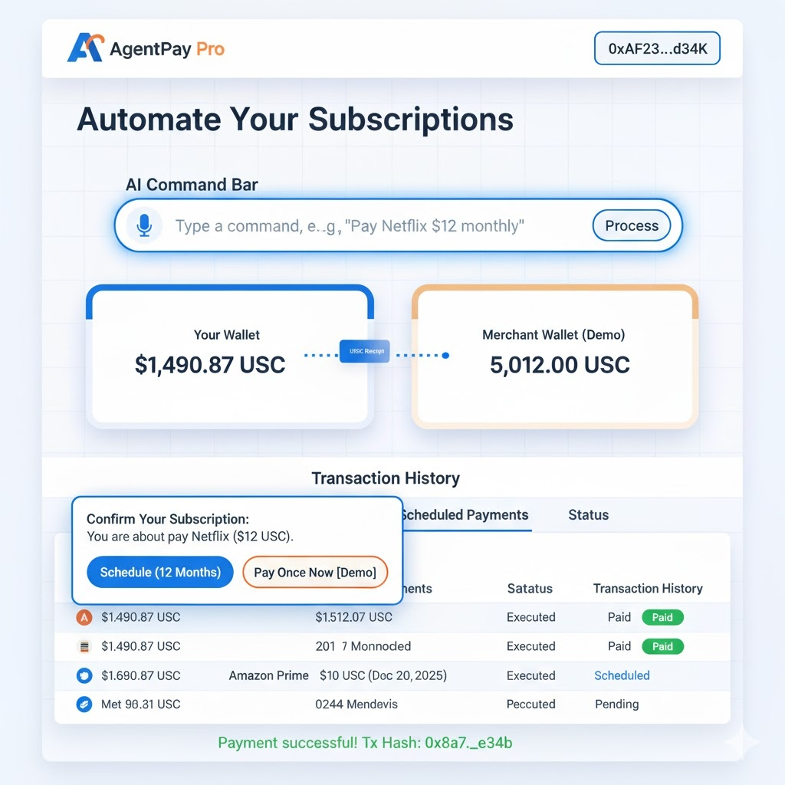

# AgentPay: AI-Powered Crypto Subscriptions on Arc



<div align="center">

### **Automate payments. Simplify life.**
Bridging the gap between AI intent and on-chain execution.

[View Demo](#-live-demo) • [Key Features](#-key-features) • [Architecture](#%EF%B8%8F-system-architecture) • [Getting Started](#-getting-started-for-developers)

</div>

---

## 🚀 The Vision
**AgentPay** is an AI agent that automates recurring crypto payments on the Arc L1 blockchain.

In traditional finance, subscriptions (like Netflix or Spotify) are easy "set and forget" actions. In crypto, they are painful—users must manually remember to sign a transaction every single month. If they forget, their service is cut off.

AgentPay solves this by combining **Natural Language Processing (NLP)** with **smart contract automation**, allowing users to schedule decentralized, recurring payments using stablecoins (USDC).

> **Built for the Arc Hackathon:** Leveraging Arc's low fees (~$0.01) and native USDC support to finally make on-chain micro-subscriptions viable.

---

## 🌟 Key Features

### 🗣️ AI Command Bar
Forget complex dApp interfaces. Just type what you want in plain English:
> *"Pay Netflix $12 monthly starting next week"*
Our AI engine parses this intent, extracts the merchant, amount, and frequency, and prepares the transaction automatically.

### ⚡ Zero-Friction "Demo Mode"
We've engineered a seamless experience for judging. The application utilizes a secure, pre-funded demo wallet to **auto-sign transactions instantly**. No waiting for wallet pop-ups—just pure, fast execution.

### 💸 Real-Time Payment Animation
Experience the flow of money. Upon confirmation, watch USDC move visibly from your wallet to the merchant's balance in real-time, providing immediate visual feedback of the on-chain action.

### 📅 True On-Chain Scheduling
Subscriptions aren't just stored in a database; they are executed trustlessly on the Arc blockchain via our custom `AgentPayScheduledPayments.sol` smart contract.

---

## 🏗️ System Architecture

AgentPay orchestrates a seamless flow from user intent to blockchain finality.

```mermaid
flowchart TD
    A[👤 User] -->|Types Command: "Pay Netflix $12 monthly"| B(🗣️ AI Command Parser)
    B -->|Extracts: Merchant, Amount, Frequency| C{⚙️ Next.js Frontend}
    C -->|1. Request Approval| D[💰 USDC Contract]
    C -->|2. Schedule Payment| E[📜 AgentPay Smart Contract]
    E -->|Executes Transfer| D
    D -->|Moves Funds| F[🏦 Merchant Wallet]
    E -->|Emits Event| C
    C -->|Updates UI| G[✅ Transaction History]

### 🔄 Data Flow
1.  **Input:** User types a natural language command.
2.  **Parsing:** The frontend AI module structures this into a JSON payload (merchant address, amount, interval).
3.  **Execution:** The app uses Ethers.js to call our smart contract on Arc.
4.  **Automation:** The `AgentPayScheduledPayments` contract handles the recurring logic and USDC transfers on-chain.

---

## 🛠️ Tech Stack

### 🎨 Frontend (The Agent)
* **Framework:** Next.js 14 (App Router) for a fast, reactive UI.
* **Styling:** CSS Modules with a custom "AgentPay Pro" theme.
* **State Management:** React Hooks & Context API for real-time balance updates.
* **Blockchain Connection:** Ethers.js (v6) for communicating with the Arc Testnet RPC.

### ⛓️ Backend (The Automation)
* **Network:** Arc Public Testnet (chosen for speed and low cost).
* **Smart Contracts:** Solidity (v0.8+).
    * `AgentPayScheduledPayments.sol`: Core logic for registering and executing recurring jobs.
    * `MockUSDC.sol`: For fully controllable testnet simulations.
* **Development Tools:** Hardhat for compilation, testing, and deployment scripts.

### 📂 Project Structure
```bash
agentpay/
├── blockchain/         # COMPLETE Smart Contract Environment (Hardhat)
│   ├── contracts/      # Solidity source code (.sol)
│   ├── scripts/        # Deployment and testing scripts (.js)
│   └── hardhat.config.js
├── src/                # Next.js Frontend Application
│   ├── app/            # App Router pages, layouts, and global styles
│   ├── components/     # Reusable UI (WalletCard, CommandBar, History)
│   └── lib/            # Blockchain utilities and Contract ABIs
├── assets/             # Images and diagrams for documentation
├── .env.local          # Secure local environment variables
└── next.config.mjs     # Next.js configuration (includes RPC proxy)
